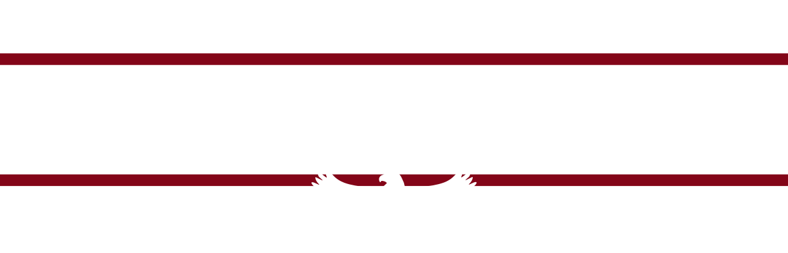
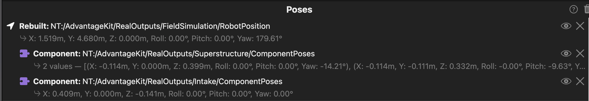

<div align="center">

<picture>
    <source media="(prefers-color-scheme: light)" srcset="images/logo/steelhawks-light-mode.svg">
    
</picture>

# Shaquille O'Steel
### FRC Team Steel Hawks 2601 :: 2026 Robot Code

[](https://github.com/wpilibsuite/allwpilib/releases/tag/v2026.2.1)
[](https://www.java.com/)
[](LICENSE)

</div>

---

<div align="center">

| | | |
|:---:|:---:|:---:|
|  |  |  |

</div>

---

## Table of Contents

- [Overview](#overview)
- [Vision Coprocessor (PoseLink)](#vision-coprocessor-poselink)
- [Branch Naming Scheme](#branch-naming-scheme)
- [AdvantageScope: Robot\_Shaq Asset](#advantagescope-robot_shaq-asset)

---

## Overview

This repository contains all robot code for **Shaquille O'Steel**, Steel Hawks' 2026 competition robot.

---

## Vision Coprocessor (PoseLink)

AprilTag pose estimation runs on an Orange Pi, not the roboRIO. The Pi fuses wheel odometry and AprilTags with a GTSAM factor graph and sends a fused pose back to the RIO over UDP; the RIO falls back to wheel-only odometry if the Pi goes quiet.

The Pi program lives in [`pi-service/`](pi-service/README.md) — its README covers the architecture, build, and Pi setup.

### Deploying

`deploy` targets the roboRIO only, so the WPILib **Deploy Robot Code** button in VS Code works as usual. To push the Pi vision service too, use `deployAll` (IntelliJ users can save it as a run configuration).

| Command | What it does |
|---------|--------------|
| `./gradlew deploy` | roboRIO only (the VS Code button) |
| `./gradlew deployAll` | roboRIO **and** Pi |
| `./gradlew deployPi` | Pi only |

> [!NOTE]
> Vision is required to play, so use `deployAll` for anything real. First-time Pi setup (GTSAM, the systemd service) is a one-time step — see [`pi-service/README.md`](pi-service/README.md). If the Pi is off when you run `deployAll`, the Pi step fails loudly so you know it didn't update; the roboRIO deploy still completes.

---

## Branch Naming Scheme

| Prefix | Purpose |
|--------|---------|
| `main` | Stable, competition-ready code |
| `feat/` | New features under development |
| `bugfix/` | Bug fixes |
| `refactor/` | Code cleanup and restructuring |
| `sandbox/` | Experimental work, not for merge |
| `event/` | Event-specific branches |

---

## AdvantageScope: Robot\_Shaq Asset

This section explains how to install the custom **Robot\_Kirin** 3D model with articulated subsystems in AdvantageScope.

### Step 1 — Open the Assets Folder

1. Open AdvantageScope
2. Navigate to **App → AdvantageScope → Show Assets Folder**
3. A folder will open on your computer — this is the root assets directory

### Step 2 — Drag the Folder In

Drag the entire **`Robot_Shaq`** folder into the AdvantageScope assets folder.

> [!IMPORTANT]
> Drag the **entire folder**, not individual files inside it.

The final structure should look like this:

```
AdvantageScopeAssets/
└── Robot_Shaq/
    ├── model.glb
    ├── config.json
    └── ...
```

### Step 3 — Restart AdvantageScope

After restarting, **Shaq** should appear in the robot selection dropdown.

### Step 4 — Add the NT Fields

With the robot model selected, drag and drop the following fields onto the **Robot** component in AdvantageScope — **in this order**:

```
NT:/AdvantageKit/RealOutputs/Superstructure/ComponentPoses
NT:/AdvantageKit/RealOutputs/Intake/ComponentPoses
```

> [!NOTE]
> Articulation currently only works in simulation.

